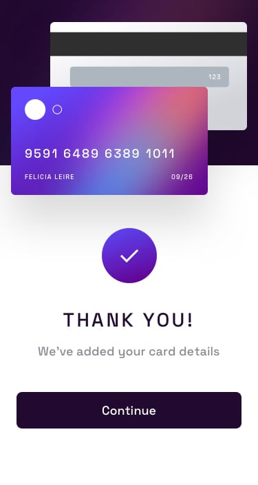

# Frontend Mentor - Cartão interativo

OBS: LAYOUT DESKTOP NÃO FINALIZADO

Esta é uma solução para o [Detalhes do cartão interativo](https://www.frontendmentor.io/challenges/interactive-card-details-form-XpS8cKZDWw).





## Bem vindo(a)! 👋

Obrigado por verificar este solução de codificação front-end.

[Frontend Mentor](https://www.frontendmentor.io) desafios que ajudam você a melhorar suas habilidades de codificação criando projetos realistas.

**Para fazer este desafio, você precisa ter um conhecimento básico de HTML e CSS e JavaScript.**

## O desafio

O desafio é criar um layout de cartão de crédito, onde o usuário pode inserir o Nome, Número do Cartão, Mês e Ano de vencimento e o Código de seguranaça (CVC), tanto na versão mobile quanto na desktop.

Os dados inseridos devem ser alterados no design que ficará disposto na tela do usuário. Após completar o preenchimento dos dados, o usuário deve ser capaz de clicar no botão "Confirm" e enviar os dados para o servidor (Que não existe), logo em seguida, será exibida uma mensagem de confirmação.

Caso o usuário não preencha os campos corretamente, o sistema deve alertá-lo sobre isso e impedir o envio dos dados.

### Links

- URL Live Server: [GitHub Pages](https://ryanwilll.github.io/layoutPagamentoCartao/)

```html
<h1>Algum código HTML do qual me orgulho</h1>
```

```css
.proud-of-this-css {
  color: papayawhip;
}
```

```js
const proudOfThisFunc = () => {
  console.log("🎉");
};
```
